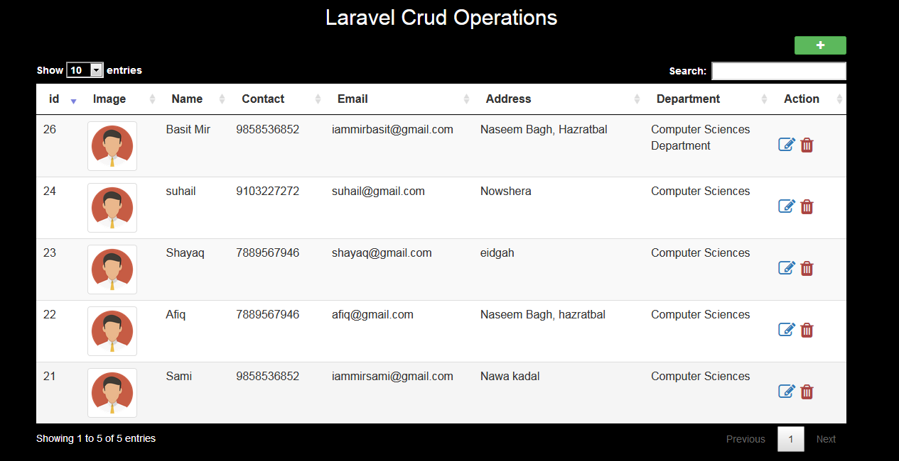

# Laravel Crud operations with Data table and ajax (using api's) 
Laravel dynamic crud operations create,update,delete and view using ajax with data tables (api's).
Image upload included...
<h3>Vist : <a href="https://crudoperationslaravel.000webhostapp.com/">Laravel_Crud</a>
#Here are the screen shots of the web Application 

 
  
  
  

  
 
 

